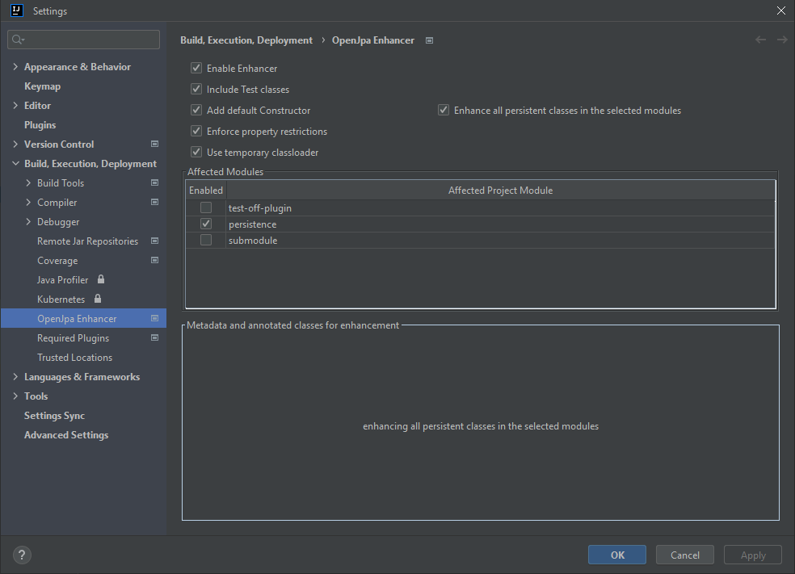

#  OpenJpa enhancer IDEA plugin

## Installation
Install the plugin "OpenJpa Enhancer" from the Marketplace
  - Press Ctrl+Alt+S to open settings and then select Plugins.
  - Click the Marketplace tab and type the "OpenJpa Enhancer" in the search field.
  - To install the plugin, click Install and restart IntelliJ IDEA.
## Configuration
Enable Enhancer for your persistence modules
  - Press Ctrl+Alt+S to open settings and then select "Build, Execution, Deployment"
  - Select "OpenJpa Enhancer"
  - Enable the checkboxes of your persistence modules under "Affected Modules"



## Build

```bash
./gradlew build
```

## Run

```bash
./gradlew runIde
```

## Note
This is a fork of https://github.com/machak/enhancer

## License
[Apache License Version 2.0](LICENSE)

## Authors
- Marijan Milicevic [machak](https://github.com/machak/)
- Hersh Shafer [hershs](https://github.com/hershs)
- Michael Schieder [mschieder](https://github.com/mschieder)

